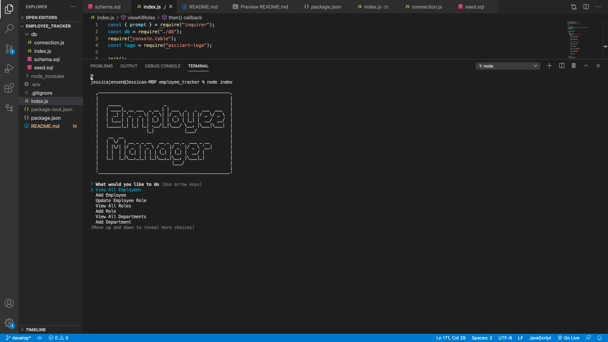

# Employee Tracker

  ## Table of Contents:
  * [Description](#description)
  * [Installation](#installation)
  * [Usage](#usage)
  * [Questions](#questions)

## Description:
A command-line application to manage a company's database of employees. 
As A business owner: 
I want to be able to view and manage the departments, roles, and employees in my company so I can organize and plan my business.  When the application starts you are presented with the following options: 
* view all departments, 
* view all roles, 
* view all employees, 
* add a department, 
* add a role, 
* add an employee, and 
* update an employee role

## Installation:
  * Node.js 
  * Inquirer
  * MySQL
  * asciiart-logo
  * console.table

## Usage:
  
  

## Questions:
  If you have any questions please reach out to me at:

  GitHub - https://github.com/jrjensen14
  
  Email - jrjensen@gmail.com
